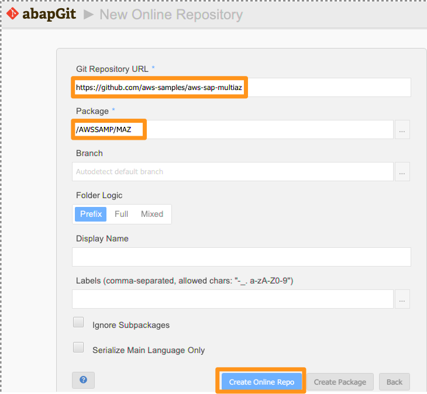
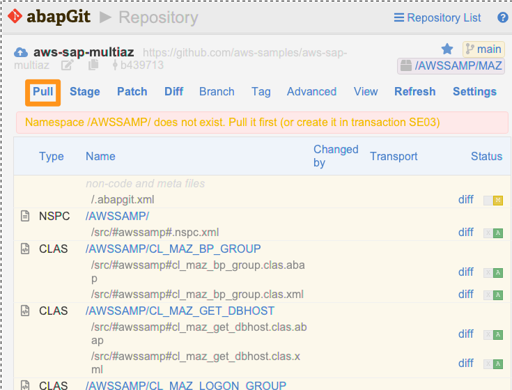
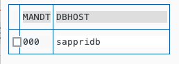

# Automate and Optimize SAP Network Performance in a Multi-AZ deployment

In this lab, you will learn how to build **Multi-AZ network optimized solution** with the features described in the [Automate and Optimise SAP Network Performance in a Multi-AZ deployment](https://quip-amazon.com/cWW0A5ofzPsn/) blog and test in your system in less than an hour. 

### Prerequisites:

* This solution was successfully tested on above S/4HANA 2022.
* To modify Logon groups and RFC server groups(RZ12), this solution will use SMLG_MODIFY function module.
* To modify Background processing groups (SM61), this solution will uses CL_BP_SERVER_GROUP class.
* To download solutions, you need to install abapGit first. For detailed instructions on how to install abapGit, please refer to the following link: [abapGit Installation Guide](https://docs.abapgit.org/user-guide/getting-started/install.html). This guide covers prerequisites, installation methods, and configuration steps to help you get started effectively.
* It also includes the ability to push messages to Amazon SNS using the [AWS SDK for SAP ABAP](https://aws.amazon.com/blogs/awsforsap/getting-started-with-aws-sdk-for-sap-abap/) to notify BC admins of alerts via email or SNS.

Here is the overall architecture in this solution


## 1. Add the Github repo to abapGit

* Login SAPGUI and go to the transaction ZABAPGIT
* Add online repo 
    * URL is https://github.com/aws-samples/aws-sap-multiaz
    * Package should be **/AWSSAMP/MAZ** and click **Create Online Repo**
    
    * Click the Pull menu. - this will download the package **/AWSSAMP/MAZ** with ABAP codes.
    


## 2. Update operational tables

Before executing this solution, we need to update **/AWSSAMP/MAZ_DB**, **/AWSSAMP/MAZ_CO** table to meet our SAP system environment. The below table is a configuration to meet the overall architecture. If you want to meet your environment, After login [AWS EC2 console](https://us-east-1.console.aws.amazon.com/ec2/home?region=us-east-1#Instances:), you can check your system configuration 

* Logon SAPGUI and then you can insert rows like the upper table using a transaction via **SE16N**. Search **/AWSSAMP/MAZ_DB**, **/AWSSAMP/MAZ_CO** table and click the execute button. you can see the table data and also execute CRUD(Create, Read, Update, Delete) function.

* **/AWSSAMP/MAZ_DB** Table
    * DBHOST : Current Active DB Hostname

    

* **/AWSSAMP/MAZ_CO** Table
    * GROUPTYPE
        * '': Logon Group
        * 'B': Batch Group
        * 'S': RFC Server Group
    * GROUPNAME : Logon/Batch/RFC Server Group name
    * DBHOST : DB Hostname
    * APHOSTS : Application server instance name.
        * e.g. **sappas**, **sapaas02** are same az with **sappridb(Database)**
        * e.g. **sapaas01**, **sapaas03** are same az with **sapsecdb(Database)**
    
    


## 3. Configuring AWS SDK for SAP ABAP

This solution also includes the ability to push messages to Amazon SNS using the **AWS SDK for SAP ABAP** to notify BC admins of alerts via email or SNS. If the Active database server would be fail, it would send an **"HANA DB server takeover to sapsecdb or sappridb"** as as elert message. After succesfully changing the groups, send an **"Finished Automate and Optimise SAP Network Performance in a Multi-AZ deployment Solution"** as as elert message.

* If you need to configure AWS SDK for SAP ABAP, Please visit to [AWS SDK for SAP ABAP Workshop - Pre-requisite infrastructure on own AWS account](https://catalog.workshops.aws/abapsdk/en-US/lab99)
* You need to create a SNS topic and cofigure relevant settings. Please go through [AWS SDK for SAP ABAP Workshop - Lab03. Amazon SNS](https://catalog.workshops.aws/abapsdk/en-US/lab03). Since the main ABAP program includes it, you don't need to create a sample program.
    


## 4. Modify a main ABAP Program.

In the main ABAP program(**/AWSSAMP/MAZ_SOL**), you need to change your SDK profile and SNS topic ARN that has created in the previous step.

* Logon SAPGUI, go to SE38 transaction and change the main ABAP program(**/AWSSAMP/MAZ_SOL**)
* In the ABAP code, update the gv_sdkprofile and gv_snsarn paraemter.


    ```ABAP
    DATA: gv_sdkprofile TYPE char20,
          gv_snsarn TYPE string.

    * Please change your sdk profile and sns topic arn.
    gv_sdkprofile = '<change your SDK profile>'.
    gv_snsarn = '<change your sns topic arn>'.
    ```

## 5. Define a Background Job.

Finally, we will define a background job to periodically(for example, every 5 minutes) execute a main ABAP program. You can define it using a transaction via **SM36**.

* Enter **MULTIAZ_NETWORK** as the Job Name, and click **Save** button.
* Select **/AWSSAMP/MAZ_SOL** as the ABAP program, and click **Save** button.
* Select **Edit > Start** time in the top menu, and click **Immediate** button.
* Select **Period values**, Select **Other preriod**, enter **5** Minutes, and click **Save** button.
* Finally, click **Save** button.


You can monitor the background job using a transaction via **SM37**. First you search **MULTIAZ_NETWORK** as the Job Name, select all job status and select **Execute** button.
If Job status would be **Finished**, the ABAP program was successfully executed. 


## Security

See [CONTRIBUTING](CONTRIBUTING.md#security-issue-notifications) for more information.

## License

This library is licensed under the MIT-0 License. See the LICENSE file.

