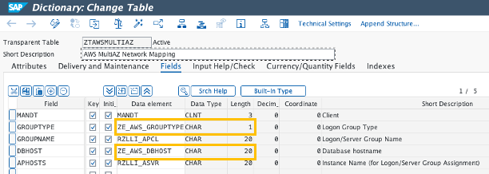

# Multi-AZ network optimized solution

In this lab, you will learn how to build **Multi-AZ network optimized solution** with the features described in the [Automate and Optimise SAP Network Performance in a Multi-AZ deployment](https://quip-amazon.com/cWW0A5ofzPsn/) blog and test in your system in less than an hour. 

### Prerequisites:

* This solution was successfully tested on above S/4HANA 2022.
* To modify Logon groups and RFC server groups(RZ12), this solution will use SMLG_MODIFY function module.
* To modify Background processing groups (SM61), this solution will uses CL_BP_SERVER_GROUP class.
* It also includes the ability to push messages to Amazon SNS using the [AWS SDK for SAP ABAP](https://aws.amazon.com/blogs/awsforsap/getting-started-with-aws-sdk-for-sap-abap/) to notify BC admins of alerts via email or SNS.

Here is the overall architecture in this solution


## 1. Create operational tables

The solution uses two operational tables.

1. **ZTAWSMULTIDB** : Save the result of SQL execution of getting an active database hostname.
2. **ZTAWSMULTIAZ** : Save the configuration information of changing application servers each groups.

You can create tables also create **ZE_AWS_DBHOST**,**ZE_AWS_GROUPTYPE**,  data elements using a transaction via **SE11**. Please refer to the below pictures for table structures.

* ZTAWSMULTIDB Table

* ZTAWSMULTIAZ Table


## 2. Update operational tables

Before executing this solution, we need to update **ZTAWSMULTIAZ** table to meet our SAP system environment. The below table is a configuration to meet the overall architecture. If you want to meet your environment, After login [AWS EC2 console](https://us-east-1.console.aws.amazon.com/ec2/home?region=us-east-1#Instances:), you can check your system configuration 

* GROUPTYPE
    * '': Logon Group
    * 'B': Batch Group
    * 'S': RFC Server Group
* GROUPNAME : Logon/Batch/RFC Server Group name
* DBHOST : DB Hostname
* APHOSTS : Application server instance name.
    * **sappas**, **sapaas02** are same az with **sappridb(Database)**
    * **sapaas01**, **sapaas03** are same az with **sapsecdb(Database)**


* You can insert rows like the upper table using a transaction via **SE16N**. Search **ZTAWSMULTIAZ** table and click the execute button. you can see the table data and also execute CRUD(Create, Read, Update, Delete) function.


## 3. Configuring AWS SDK for SAP ABAP

This solution also includes the ability to push messages to Amazon SNS using the **AWS SDK for SAP ABAP** to notify BC admins of alerts via email or SNS. If the Active database server would be fail, it will send an **"HANA DB server takeover to sapsecdb or sappridb"** as as elert message. After succesfully chaing the groups, send an **"Successfully changed Logon/RFC/Batchjob Group"** as as elert message.

* If you need to configure AWS SDK for SAP ABAP, Please visit to [AWS SDK for SAP ABAP Workshop - Pre-requisite infrastructure on own AWS account](https://catalog.workshops.aws/abapsdk/en-US/lab99)
* And then, you need to create a SNS topic and cofigure relevant settings. Please go through [AWS SDK for SAP ABAP Workshop - Lab03. Amazon SNS](https://catalog.workshops.aws/abapsdk/en-US/lab03). Since the main ABAP program includes it, you don't need to create a sample program.
    


## 4. Create a main ABAP Program.

Now, we will create a main ABAP Program. you can create it using the ABAP Editor transaction via **SE38**. 

* If you would be not familiar with ABAP develop, please visit to [AWS SDK for SAP ABAP Workshop - Lab03. Amazon SNS - 4.Write the sample code](https://catalog.workshops.aws/abapsdk/en-US/lab03/lab03-01#4.-write-the-sample-code).
* And Please refer to the source code here - [multiaz_network_optimized_solution](./multiaz_network_optimized_solution/ZAWS_MULTIAZ_NETWORK.abap). And drag and copy & paste in the ABAP Editor(SE38)
* And In the ABAP code, change your SDK profile and SNS topic ARN that create in the previous step.

    ```ABAP
    * Please change your sdk profile and sns topic arn.
    DATA: gv_sdkprofile TYPE char20,
          gv_snsarn TYPE string.

    gv_sdkprofile = '<change your SDK profile>'.
    gv_snsarn = '<change your sns topic arn>'.
    ```

## 5. Define a Background Job.

Finally, we will define a background job to execute a main ABAP program every 5 minutes. You can define it using a transaction via **SM36**.

* Enter **MULTIAZ_NETWORK** as the Job Name, and click **Save** button.
* Select **ZAWS_MULTIAZ_NETWORK** as the ABAP program, and click **Save** button.
* Select **Edit > Start** time in the top menu, and click **Immediate** button.
* Select **Period values**, Select **Other preriod**, enter **5** Minutes, and click **Save** button.
* Finally, click **Save** button.


You can monitor the background job using a transaction via **SM37**. First you search **MULTIAZ_NETWORK** as the Job Name, select all job status and select **Execute** button.
If Job status would be **Finished**, the ABAP program was successfully executed. 


## Security

See [CONTRIBUTING](CONTRIBUTING.md#security-issue-notifications) for more information.

## License

This library is licensed under the MIT-0 License. See the LICENSE file.

